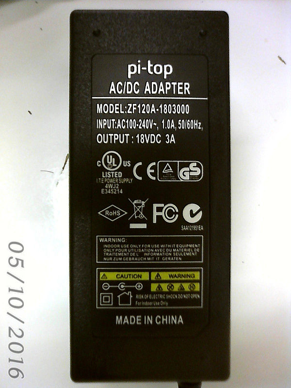

# AC/DC アダプタの検討

## 製品の概要

Table: 仕様

| Model          | INPUT                  |OUTPUT    |
|----------------|------------------------|----------|
| ZF120A-1803000 |AC100-240V, 1.0A 50/60Hz|DC18V, 3A |
| YHY-18003000   |AC100-240V, 2.5A 50/60Hz|DC18V, 3A |

サイズはおおよそ 12 x 5 x 3 cm。 ZF120Aは、これより若干小さい。

* ２種類のモデルのうち、現物を確認したのはZF120Aのみ。
* Test report を入手したのは、YHYのみ。

## 電安法

pi-topがバンドルするACアダプタは、北アメリカ(UL, FCC)とヨーロッパ(CE)の基準に適合したマークが付されている。
しかし、日本の基準に適合している旨の表示（特定電気用品の<PSE>マーク）がない。

→ <PSE>マークのない商品は、販売できない. （電安法の特定電気用品に該当）

### 選択肢は２つ。
* ＜PSE＞マークの付いている商品をバンドルする
* 自社で<PSE>マークをつける。

### 検討
pi-topからACアダプタのテストレポート等を送ってもらったが、バンドルされているACアダプタの調達先が一定していないようだ。
（現時点では、２つのメーカーが確認できている。）今後どうなるか予測できない。

PSEマークをつけるためには、
* test report の確認と保管
* 適合同等証明書 Certificate of Conformity の副本（認証謄本の現物）を製造元を通してテストセンターから取得
* 出荷前検査と検査履歴の保管
→ 日本で輸入者（弊社）がPSEマークをつけても、調達先が変更されるたびに、これらをやらないといけない。少量輸入だと費用がかさむ。

## 判断
ACアダプタは、<PSE>マーク付きの社外品を調達してバンドルする。

### 調達予定の社外品
* Input AC100V, Output DC18V, 3A. Size 12 x 5 x 3 cm 以内

